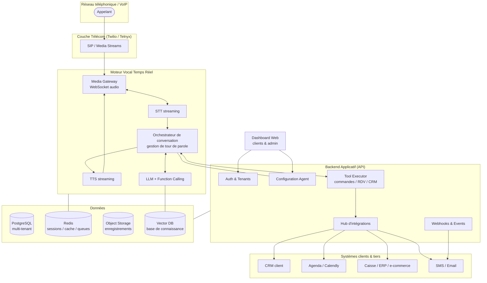
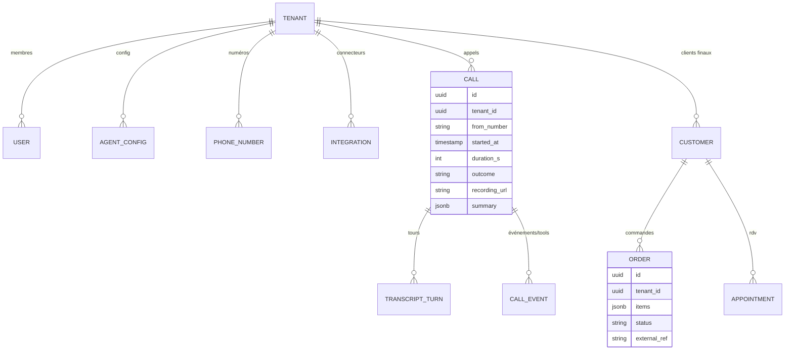
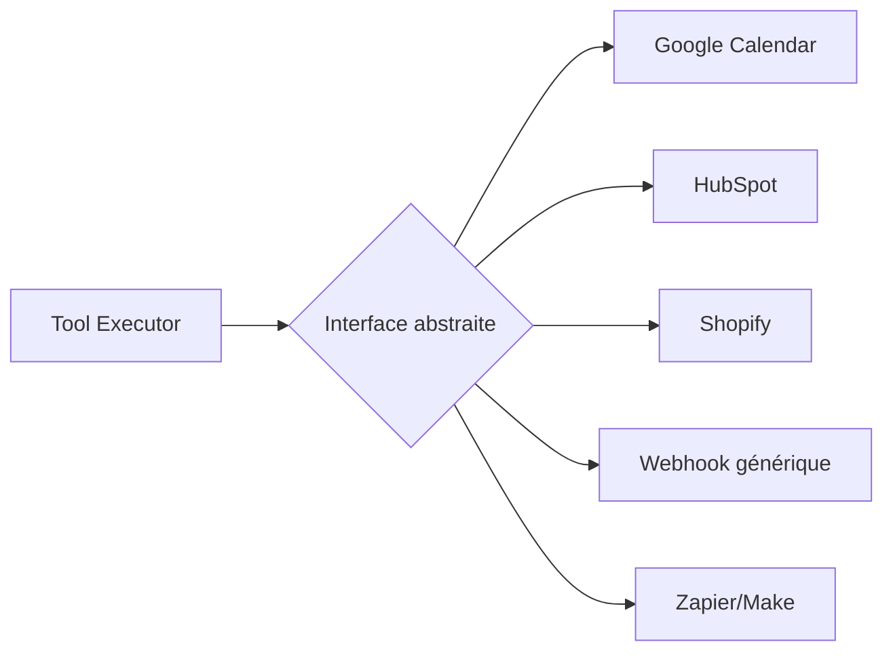

# Architecture — SaaS Agent IA Vocal

> Plateforme SaaS permettant à des clients (commerçants, restaurants, cabinets, services)
> de déléguer leurs **appels entrants** à un **agent IA vocal** capable de : répondre,
> prendre des commandes, fixer des rendez‑vous, faire du suivi, renseigner le CRM et
> interagir avec les systèmes métiers propres à chaque client.
>
> Stratégie : démarrer avec un **nombre restreint de clients pilotes** (design partners),
> puis ouvrir au public. L'architecture est pensée pour être **simple à opérer au début**
> mais **sans dette bloquante** au moment de scaler.

---

## 1. Vision produit & principes directeurs

| Principe | Décision |
|---|---|
| **Multi-tenant dès le jour 1** | Chaque client = un *tenant* isolé logiquement (données, config, voix, prompts). Évite une refonte au passage public. |
| **Latence conversationnelle < 800 ms** | La qualité perçue d'un agent vocal dépend avant tout du temps de réponse. Choix techno guidés par la latence. |
| **Human-in-the-loop** | Escalade vers un humain (transfert d'appel / notification) quand l'agent n'est pas sûr. Indispensable en phase pilote. |
| **Config, pas de code, par client** | Onboarder un client = remplir une configuration (prompt, horaires, catalogue, intégrations), pas déployer du code. |
| **Observabilité totale** | Chaque appel est traçable, enregistré (avec consentement), transcrit et rejouable. Critique pour améliorer l'agent. |
| **RGPD by design** | Hébergement UE, consentement, minimisation, rétention limitée. Non négociable en France/UE. |

---

## 2. Vue d'ensemble



---

## 3. Le cœur : le pipeline vocal temps réel

C'est la brique différenciante et la plus difficile. Deux approches possibles :

### Option A — Pipeline cascade (STT → LLM → TTS) — **recommandé pour démarrer**
- **STT** (speech-to-text) en streaming : Deepgram, ou Whisper/Azure Speech.
- **LLM** avec *function calling* : Claude (Anthropic) ou GPT-4o, en streaming.
- **TTS** (text-to-speech) en streaming : ElevenLabs / Cartesia / Azure Neural.
- **Avantages** : chaque brique remplaçable, débogable, on voit la transcription, contrôle fin.
- **Inconvénient** : latence cumulée → il faut streamer chaque étape et démarrer le TTS dès les premiers tokens.

### Option B — Speech-to-speech temps réel
- API vocales natives (OpenAI Realtime, Gemini Live) : audio → audio, latence minimale, intonation naturelle.
- **Inconvénient** : boîte plus fermée, moins de contrôle sur les tools/transcription, coût, lock-in.

> **Recommandation** : démarrer en **Option A** (contrôle + observabilité pour les pilotes), garder une
> abstraction `VoiceEngine` permettant de basculer en Option B plus tard sans réécrire le métier.

### Framework d'orchestration
Ne pas réinventer la gestion du tour de parole (VAD, interruptions/barge-in, silences, endpointing).
Utiliser un framework établi :
- **Pipecat** (open-source, Python) — recommandé, flexible, self-host.
- **LiveKit Agents** — solide si l'on veut du WebRTC/scaling managé.
- **Vapi / Retell** — plateformes managées : idéales pour **valider le produit très vite** en phase pilote,
  à ré-internaliser ensuite pour les marges et le contrôle.

Points clés à gérer dans l'orchestrateur :
- **Barge-in** : l'appelant coupe la parole → stopper le TTS immédiatement.
- **Endpointing** : détecter la fin d'une prise de parole sans couper trop tôt.
- **Backchanneling** : « mhm », « d'accord » pour un rendu naturel.
- **Fallback** : si latence/erreur → phrase d'attente, puis escalade humaine.

---

## 4. Backend applicatif

Une **API** (FastAPI/Python — cohérent avec Pipecat, ou NestJS/Node) exposant :

- **Auth & multi-tenant** : chaque requête porte un `tenant_id`. Isolation par *Row-Level Security* PostgreSQL.
- **Gestion de configuration d'agent** : prompt système, personnalité/voix, horaires, langues, catalogue produits, règles d'escalade.
- **Tool Executor** : les fonctions que le LLM peut appeler (voir §5).
- **Hub d'intégrations** : connecteurs vers les systèmes clients (voir §6).
- **Webhooks & événements** : notifier le client (nouvelle commande, RDV pris), déclencher SMS/email.

### Tools exposés au LLM (function calling)
```
create_order(items[], customer, delivery_or_pickup, time)
check_availability(service, date_range)      → agenda
book_appointment(service, datetime, customer)
get_customer(phone) / upsert_customer(...)   → CRM
lookup_product(query)                        → catalogue / base de connaissance
transfer_to_human(reason)                    → escalade
send_confirmation(channel, template)         → SMS/email
```
Chaque tool est **scopé au tenant** et **idempotent** (l'agent peut répéter un appel).

---

## 5. Multi-tenancy & modèle de données

Base **PostgreSQL** unique avec `tenant_id` sur chaque table + **Row-Level Security** (simple, suffisant
jusqu'à plusieurs centaines de clients ; on isolera physiquement les gros comptes plus tard).



- **Redis** : état de session vocale en cours, files d'attente (jobs post-appel : sync CRM, envoi SMS), rate-limiting, cache config.
- **Object storage (S3/GCS UE)** : enregistrements audio + transcriptions.
- **Vector DB** (pgvector d'abord, suffisant) : base de connaissance par tenant (menu, FAQ, politique) pour du RAG.

---

## 6. Intégration avec les systèmes propres des clients

C'est là que se joue la valeur *et* la complexité. Stratégie en couches :

1. **Connecteurs natifs** pour les plus demandés : Google Calendar/Calendly, HubSpot/Pipedrive/Salesforce,
   Shopify/WooCommerce, Zapier/Make (couvre des centaines d'outils sans dev).
2. **Webhooks sortants + API entrante générique** : le client reçoit nos événements et/ou nous expose une API.
3. **Interface d'intégration abstraite** (`CrmProvider`, `CalendarProvider`, `CatalogProvider`) : le Tool Executor
   parle à l'interface, chaque client mappe son système derrière. Évite de coder en dur.



- **Secrets par tenant** (tokens OAuth, clés API) chiffrés (Vault / KMS + colonnes chiffrées).
- **Queue asynchrone** pour les syncs non temps-réel (post-appel), avec retry/back-off.
- **Circuit breaker** : si le système client est down, l'agent le dit et prend le message / escalade, sans planter l'appel.

---

## 7. Dashboard clients & back-office

**Frontend** : Next.js/React (Vercel ou conteneur).

Pour les **clients** :
- Onboarding : achat/portage du numéro, configuration de l'agent (voix, ton, horaires), connexion des intégrations.
- Historique des appels : écoute, transcription, résumé, issue (commande/RDV/transfert).
- Commandes & RDV, statistiques (taux de prise en charge, durée, taux d'escalade).
- Base de connaissance (menu, FAQ) éditable.

Pour l'**admin (vous)** :
- Supervision temps réel des appels (surtout en phase pilote), qualité, coûts par appel/tenant.
- Feature flags, gestion des tenants, facturation.

---

## 8. Sécurité, conformité & RGPD (marché FR/UE)

- **Hébergement UE** (Scaleway, OVHcloud, ou AWS/GCP région EU) — argument commercial fort.
- **Consentement d'enregistrement** : message d'annonce en début d'appel (« cet appel peut être enregistré… »).
- **Minimisation & rétention** : durée de conservation configurable (ex. 30–90 j), purge automatique, droit à l'effacement.
- **Chiffrement** at-rest et in-transit ; secrets clients isolés et chiffrés.
- **Isolation tenant** : RLS + tests d'isolation ; jamais de fuite inter-tenant dans les prompts/RAG.
- **PII** : masquage des données sensibles (CB, santé) dans les logs/transcriptions.
- **DPA** avec les sous-traitants (Twilio, LLM, TTS) ; privilégier fournisseurs avec zero-retention.
- **Auth** : OAuth2/OIDC (Auth0/Clerk/Supabase Auth), MFA pour les comptes clients.

---

## 9. Observabilité & amélioration continue

- **Traces d'appel** de bout en bout : audio, transcription, tokens LLM, appels de tools, latences par étape.
- **Métriques** : latence P50/P95 par étape, taux d'escalade, taux de succès par intention, coût/appel.
- **Évaluation** : jeu de cas de test rejouables (simulateur d'appelant), scoring des transcriptions, détection des hallucinations/erreurs de tool.
- **Stack** : OpenTelemetry + Grafana/Prometheus ; Langfuse/Helicone pour le tracing LLM ; Sentry pour les erreurs.

---

## 10. Coûts par appel (à modéliser tôt)

Le coût unitaire d'un appel = télécom + STT + LLM (tokens) + TTS. À une conversation de quelques minutes,
c'est **quelques dizaines de centimes**. Conséquences :
- Suivre le **coût par appel et par tenant** dès le début (marge, tarification à l'usage/abonnement + quota).
- Optimiser : TTS/STT streaming (pas de gaspillage), prompts concis, cache des réponses fréquentes, choix de modèles adaptés (petit modèle pour le routage, gros pour la conversation).

---

## 11. Feuille de route par phases

### Phase 0 — Prototype (2–4 sem.)
- 1 numéro Twilio, pipeline Pipecat (Deepgram + LLM + ElevenLabs), 1 seul use case (ex. prise de RDV).
- Pas de dashboard : config en fichier. Objectif : **valider la qualité vocale et la latence**.

### Phase 1 — Pilotes (nombre restreint de clients)
- Multi-tenant (RLS), dashboard minimal, historique d'appels, 2–3 intégrations natives + Zapier.
- **Escalade humaine** systématique en filet de sécurité, supervision manuelle des appels.
- Boucle d'amélioration : écouter → corriger prompts/tools → réévaluer. C'est ici qu'on gagne en qualité.

### Phase 2 — Durcissement (avant public)
- Onboarding self-service, facturation à l'usage, quotas & rate-limiting, RGPD complète (rétention, effacement).
- Observabilité complète, tests d'isolation tenant, runbooks d'incident, SLA.
- Scaling du moteur vocal (workers autoscalés, régions).

### Phase 3 — Ouverture publique
- Marketplace de connecteurs, multi-langue, A/B testing des voix/prompts, self-onboarding numéro.
- Éventuel passage partiel en speech-to-speech (Option B) là où la latence prime.

---

## 12. Stack recommandée (synthèse)

| Domaine | Choix pilote | Alternative / scale |
|---|---|---|
| Télécom | Twilio | Telnyx (moins cher au volume) |
| Orchestration vocale | Pipecat (self-host) | LiveKit Agents ; Vapi/Retell (managé pour aller vite) |
| STT | Deepgram | Azure Speech / Whisper |
| LLM | Claude / GPT-4o (function calling) | modèle open self-host au volume |
| TTS | ElevenLabs / Cartesia | Azure Neural |
| Backend | FastAPI (Python) | NestJS (Node) |
| Base de données | PostgreSQL + pgvector + RLS | + isolation physique gros comptes |
| Cache / files | Redis | + broker dédié (RabbitMQ/SQS) |
| Object storage | S3/GCS région UE | Scaleway/OVH |
| Frontend | Next.js | — |
| Auth | Clerk / Supabase / Auth0 | Keycloak self-host |
| Infra | Docker + un orchestrateur | Kubernetes au scale |
| Observabilité | OTel + Grafana + Langfuse + Sentry | — |
| Hébergement | UE (Scaleway/OVH/AWS-eu) | multi-région |

---

## 13. Risques principaux & mitigations

| Risque | Mitigation |
|---|---|
| Latence perçue trop élevée | Streaming à toutes les étapes, endpointing soigné, phrases d'attente, mesure P95. |
| Hallucination / mauvaise commande | Tools stricts + confirmation orale (« vous confirmez 2 pizzas… ? »), garde-fous, escalade. |
| Système client indisponible | Circuit breaker, prise de message + sync différée, jamais de plantage d'appel. |
| Fuite inter-tenant | RLS, tests d'isolation, scoping strict du RAG et des prompts. |
| Coûts qui dérapent | Suivi coût/appel, quotas, choix de modèles, cache. |
| Conformité RGPD | Hébergement UE, consentement, rétention/effacement, DPA, fournisseurs zero-retention. |
| Lock-in fournisseur vocal | Abstraction `VoiceEngine` / interfaces d'intégration. |

---

*Document d'architecture initial — à faire évoluer avec les retours des clients pilotes.*
